# goit-nosql-hw-03


***Технiчний опис завдань***

# **Завдання 3: Граф знань для рекомендаційної системи**

## **Цілі цього завдання:**

**Мета цього завдання:** освоїти повний цикл роботи з графовою базою даних — від проектування схеми та завантаження реальних даних до написання складних запитів і запуску алгоритмів аналізу графів. На практиці зрозуміти, де графова модель виграє у реляційної, а де програє.

## **Опис завдання:**

Ви будуєте рекомендаційний рушій на основі графа. Дані — реальний датасет фільмів з оцінками користувачів.

**Датасет:** [MovieLens 1M](https://grouplens.org/datasets/movielens/1m) — 1 мільйон оцінок від 6 040 користувачів для 3 883 фільмів, з жанрами та демографією. Зібраний GroupLens Research широко використовується в академічних дослідженнях рекомендаційних систем.

Архів містить три файли даних і `README` з детальним описом — прочитайте його до початку роботи:

- `movies.dat` — 3 883 фільми: унікальний ID, назва з роком випуску та список жанрів через `|` (18 жанрів: від `Action` і `Comedy` до `Film-Noir` і `Children's`)
- `users.dat` — 6 040 користувачів: стать, вікова група, код професії та поштовий індекс
- `ratings.dat` — 1 000 209 оцінок за шкалою 1–5 з Unix-таймстемпом; кожен користувач оцінив не менше 20 фільмів

Усі три файли використовують роздільник `::` і кодування **Latin-1** — це важливо при завантаженні (*детальніше в частині 2*). Завантажте архів і розпакуйте його.

### Хід роботи:

1. Завантажити та розпакувати датасет MovieLens 1M, конвертувати `.dat` файли у CSV
2. Розгорнути Neo4j через Docker або зареєструватися в AuraDB
3. Спроектувати схему графа та обґрунтувати рішення — вузли, ребра, властивості
4. Завантажити дані: створити індекси, завантажити вузли та ребра батчами
5. Написати 6 Cypher-запитів зростаючої складності — від простих фільтрацій до рекомендацій і пошуку шляхів
6. Знайти супервузли та пояснити їхній вплив на продуктивність
7. Запустити три алгоритми GDS: PageRank, Louvain і Dijkstra — та змістовно інтерпретувати результати
8. Порівняти графовий підхід з реляційним і зробити висновки

***Структура репозиторію:***

```text
.
├── docker-compose.yml          # локальний запуск Neo4j
├── convert.py                  # конвертація .dat → .csv
├── import/                     # CSV-файли для завантаження (не комітьте самі .dat)
│   ├── movies.csv
│   ├── users.csv
│   └── ratings.csv
├── queries/
│   ├── part2_load.cypher       # створення індексів і завантаження даних
│   ├── part3.cypher            # всі запити частини 3
│   ├── part4_supernodes.cypher
│   └── part5_gds.cypher
└── README.md                   # відповіді на всі питання + скриншоти
```

---

## 🔹 **Налаштування оточення**

Дозволяються два варіанти — **оберіть будь-який**.

### **Варіант A: Neo4j локально через Docker**

Збережіть файл `docker-compose.yml` у корінь проекту:

```dockerfile
services:
neo4j:
image: neo4j:5.18-community
container_name: neo4j_movielens
ports:
-"7474:7474"
-"7687:7687"
environment:
NEO4J_AUTH: neo4j/password123
NEO4J_PLUGINS:'["apoc", "graph-data-science"]'
NEO4J_dbms_security_procedures_unrestricted:"apoc.*,gds.*"
NEO4J_dbms_security_procedures_allowlist:"apoc.*,gds.*"
NEO4J_dbms_memory_heap_initial__size:"512m"
NEO4J_dbms_memory_heap_max__size:"2G"
volumes:
- neo4j_data:/data
- neo4j_logs:/logs
- ./import:/var/lib/neo4j/import

volumes:
neo4j_data:
neo4j_logs:
```

***Запуск:***

```bash
docker-compose up -d
```

Після старту відкрийте [`http://localhost:7474`](http://localhost:7474) — Neo4j Browser.

Логін: `neo4j`, пароль: `secret12345`.

Скопіюйте файли датасету до папки `import/` у корені проекту — звідти Neo4j зможе їх читати через `LOAD CSV`.

### **Варіант B: Neo4j AuraDB (хмара)**

1. Зареєструйтеся на [neo4j.com/product/auradb](https://neo4j.com/product/auradb) — безкоштовного рівня достатньо для завдання
2. Створіть інстанс, збережіть виданий пароль
3. APOC і GDS підключені за замовчуванням
4. Для завантаження даних використовуйте `LOAD CSV` із публічно доступним URL або завантажуйте через Neo4j Browser (кнопка «Import»)

> ❗️ **Важливо:** безкоштовний AuraDB має обмеження на розмір бази (~200 MB). Якщо упретеся в ліміт — використовуйте підмножину даних: перші 200 000 рядків з `ratings.dat`.

---

## 🔹 **Частина 1 — проектування схеми**

**Мета:** перш ніж писати код, продумати структуру графа. Гарна схема — половина успіху; погана схема перетворює прості запити на муку.

### Завантаження

Опишіть схему графа: вузли (з лейблами та властивостями), типи ребер (з напрямком і властивостями). Поясніть логіку своїх рішень.

***Обов’язково дайте відповіді на такі питання (письмово у файлі README):***

1. Які сутності стали вузлами, а які — **ребрами**? Чому?
2. **Оцінка користувача за фільм** — це ребро `(User)-[:RATED]->(Movie)` чи окремий вузол `(Rating)`? Аргументуйте своє рішення. Це не риторичне запитання: в обох підходів є реальні trade-off-и.
3. Чому жанри фільму вигідніше зберігати як окремі вузли `(Genre)`, а не як список у властивості вузла `Movie`?

### 💡 Підказка щодо структури

Для старту можна взяти за основу таку модель і скоригувати під свої аргументи:

```cypher
(User {userId, gender, age, occupation})
(Movie {movieId, title, year})
(Genre {name})

(User)-[:RATED {rating, timestamp}]->(Movie)
(Movie)-[:HAS_GENRE]->(Genre)
```

**Намалюйте схему — хоча б у вигляді ASCII-діаграми в README. Це обов’язкова частина відповіді.**

---

## 🔹 **Частина 2 — Завантаження даних**

**Мета:** навчитися завантажувати великі обсяги даних у Neo4j без помилок.

### Підготовка файлів

Файли MovieLens використовують роздільник `::` і кодування Latin-1. Перед завантаженням конвертуйте їх у CSV з роздільником `,` і кодуванням UTF-8:

```py
# convert.py — запустіть один раз перед завантаженням
import csv

# movies.dat: MovieID::Title::Genres
with open('movies.dat', encoding='latin-1') as f_in, \
     open('import/movies.csv', 'w', newline='', encoding='utf-8') as f_out:
    writer = csv.writer(f_out)
    writer.writerow(['movieId', 'title', 'genres'])
    for line in f_in:
        parts = line.strip().split('::')
        writer.writerow(parts)

# ratings.dat: UserID::MovieID::Rating::Timestamp
with open('ratings.dat', encoding='latin-1') as f_in, \
     open('import/ratings.csv', 'w', newline='', encoding='utf-8') as f_out:
    writer = csv.writer(f_out)
    writer.writerow(['userId', 'movieId', 'rating', 'timestamp'])
    for line in f_in:
        parts = line.strip().split('::')
        writer.writerow(parts)

# users.dat: UserID::Gender::Age::Occupation::Zip
with open('users.dat', encoding='latin-1') as f_in, \
     open('import/users.csv', 'w', newline='', encoding='utf-8') as f_out:
    writer = csv.writer(f_out)
    writer.writerow(['userId', 'gender', 'age', 'occupation'])
    for line in f_in:
        parts = line.strip().split('::')
        writer.writerow(parts[:4])  # zip не потрібен
```

### Завантаження вузлів

Завантажте вузли в базу даних. Всі запити збережіть у файл `part2_load.cypher`. У README поясніть кожен запит: що він робить і чому написаний саме так.

Використовуйте `MERGE` замість `CREATE` — це захист від дублювання при повторному запуску скрипту:

```cypher
// 1. Користувачі
LOAD CSV WITH HEADERS FROM 'file:///users.csv' AS row

!!! МІСЦЕ ДЛЯ ВАШОГО КОДУ !!!
// Повний код реалізації знаходиться у файлі: part2_load.cypher
```

### Індекси

Створіть індекси **до** завантаження ребер — це прискорить пошук вузлів при створенні зв’язків:

```cypher
!!! МІСЦЕ ДЛЯ ВАШОГО КОДУ !!!
// Повний код реалізації знаходиться у файлі: part2_load.cypher
```

### Завантаження ребер (оцінок)

Завантажте ребра в базу даних. Швидше за все, ребер у вас буде досить багато, тому їх не можна завантажувати однією транзакцією — вона впаде через таймаут або пам’ять. Використовуйте `apoc.periodic.iterate`, який розбиває роботу на батчі:

```cypher
!!! МІСЦЕ ДЛЯ ВАШОГО КОДУ !!!
// Повний код реалізації знаходиться у файлі: part2_load.cypher
```

> ❗️ **Чому** `parallel: false`?
> При паралельному завантаженні кілька потоків можуть одночасно спробувати створити один і той самий вузол. Якщо ви впевнені, що вузли вже створені і використовуєте лише `MATCH` (не `MERGE`) у тілі — можна спробувати `parallel: true` для прискорення. В інших випадках краще не ризикувати.

***Перевірте результат:***

```cypher
MATCH (u:User) RETURN count(u) AS users;
MATCH (m:Movie) RETURN count(m) AS movies;
MATCH ()-[r:RATED]->() RETURN count(r) AS ratings;
```

---

## 🔹 **Частина 3 — Запити різної складності**

**Мета:** навчитися писати Cypher-запити від простих фільтрацій до багатокрокових обходів графа.

**Всі запити збережіть у файл `queries/part3.cypher`. У README поясніть кожен запит: що він робить і чому написаний саме так.**

Напишіть такі запити до бази даних.

### Базові запити

#### **Запит 1.** Знайти всі фільми жанру «Thriller» із середнім рейтингом вище 4.0:

```cypher
!!! МІСЦЕ ДЛЯ ВАШОГО КОДУ !!!
// Повний код реалізації знаходиться у файлі: part3_queries.cypher
```

#### **Запит 2.** Знайти користувачів, які поставили оцінку 5 більш ніж 50 фільмам:

```cypher
!!! МІСЦЕ ДЛЯ ВАШОГО КОДУ !!!
// Повний код реалізації знаходиться у файлі: part3_queries.cypher
```

### Запити середнього рівня

#### **Запит 3.** Знайти фільми, які **обидва** користувачі (наприклад, userId=1 і userId=2) оцінили високо (рейтинг ≥ 4):

```cypher
!!! МІСЦЕ ДЛЯ ВАШОГО КОДУ !!!
// Повний код реалізації знаходиться у файлі: part3_queries.cypher
```

#### **Запит 4.** Знайти жанри, чиї фільми стабільно отримують високі оцінки — середній рейтинг і кількість оцінок:

```cypher
!!! МІСЦЕ ДЛЯ ВАШОГО КОДУ !!!
// Повний код реалізації знаходиться у файлі: part3_queries.cypher
```

### Складні запити

#### **Запит 5.** Рекомендація «користувачі зі схожими смаками також дивилися»: для заданого користувача знайти фільми, які він ще **не** дивився, але високо оцінили користувачі з подібними смаками:

```cypher
!!! МІСЦЕ ДЛЯ ВАШОГО КОДУ !!!
// Повний код реалізації знаходиться у файлі: part3_queries.cypher
```

#### **Запит 6.** Знайти найкоротший ланцюжок зв’язку між двома користувачами через спільні фільми:

```cypher
!!! МІСЦЕ ДЛЯ ВАШОГО КОДУ !!!
// Повний код реалізації знаходиться у файлі: part3_queries.cypher
```

***Обов’язково дайте відповіді на такі запитання (письмово у файлі README):***

1. Що означає довжина шляху в даному контексті?
2. Один хоп — це один крок по ребру `RATED`, а значить — шлях довжини 2 означає, що два користувачі оцінили один і той самий фільм.
3. Як інтерпретувати шлях довжини 4? Довжини 6?

---

## 🔹 **Частина 4 — Виявлення супервузлів**

**Мета:** зрозуміти, що таке супервузли і чому вони — проблема для продуктивності.

**Всі запити збережіть у файл `queries/part4_supernodes.cypher`. У README поясніть кожен запит: що він робить і чому написаний саме так.**

### Завдання

#### **Крок 1.** Знайдіть вузли з аномально великою кількістю ребер:

```cypher
!!! МІСЦЕ ДЛЯ ВАШОГО КОДУ !!!
// Повний код реалізації знаходиться у файлі: part4_supernodes.cypher
```

***Обов’язково дайте відповіді на такі питання (письмово у файлі README):***

1. Які вузли виявилися супервузлами? Скільки у них зв’язків?
2. Чому запит, що зачіпає такий вузол, працює повільніше, ніж запит по «звичайному» вузлу з тими самими індексами?
3. Яку конкретну стратегію з лекцій ви б застосували для цього датасету? (Підказка: подивіться на жанрові вузли — вони теж супервузли?) Що з ними робити?

---

## 🔹 **Частина 5 — Графові алгоритми через GDS**

**Мета:** запустити три класичні алгоритми з бібліотеки Graph Data Science та змістовно інтерпретувати результати.

> ❗️ Перед запуском алгоритмів потрібно створити **проекцію графа** в пам’яті GDS. Це окремий крок — GDS не працює безпосередньо зі збереженим графом.

**Всі запити збережіть у файл `queries/part5_gds.cypher`. У README поясніть кожен запит: що він робить і чому написаний саме так.**

### 5.1. PageRank на графі фільмів

Побудуємо граф, де фільми пов’язані через користувачів, які оцінили обидва фільми високо. Далі запустіть алгоритм PageRank на отриманому графі, проаналізуйте результати та дайте відповіді на питання в кінці секції.

```cypher
// Крок 1: матеріалізуємо ребра фільм-фільм через спільних користувачів
MATCH (m1:Movie)<-[r1:RATED]-(u:User)-[r2:RATED]->(m2:Movie)
WHERE r1.rating >= 4 AND r2.rating >= 4 AND id(m1) < id(m2)
WITH m1, m2, count(u) AS weight
WHERE size([(m1)<-[:RATED]-() | 1]) > 20
  AND size([(m2)<-[:RATED]-() | 1]) > 20
WITH m1, m2, weight
ORDER BY weight DESC
LIMIT 50000
MERGE (m1)-[co:CO_RATED]-(m2)
SET co.weight = weight;

// Крок 2: створюємо проекцію на основі матеріалізованих ребер
CALL gds.graph.project(
  'movieGraph',
  'Movie',
  { CO_RATED: { orientation: 'UNDIRECTED', properties: 'weight' } }
)
YIELD graphName, nodeCount, relationshipCount;

!!! МІСЦЕ ДЛЯ ВАШОГО КОДУ !!!
// Повний код реалізації знаходиться у файлі: part5_gds.cypher

// Крок 4: видаляємо проекцію та тимчасові ребра
CALL gds.graph.drop('movieGraph');
MATCH ()-[co:CO_RATED]-() DELETE co;
```

> ❗️ **Попередження:** Крок 1 може зайняти кілька хвилин на повному датасеті. Якщо виконується занадто довго, зменшіть `LIMIT 50000` до меншого значення або підвищте поріг рейтингу з `>= 4` до `= 5`.

***Обов’язково дайте відповідь на таке питання (письмово у файлі README):***

1. Що означає високий PageRank для фільму в цьому графі? Це просто “популярний фільм” чи щось інше?

### 5.2. Виявлення спільнот (Louvain)

Louvain — алгоритм виявлення спільнот у графі. Він шукає групи вузлів, які щільно пов’язані між собою і слабко — з рештою графа. У нашому випадку це кластери користувачів, які дивляться схожі фільми. Якість розбиття вимірюється метрикою **modularity** — вона показує, наскільки щільність ребер всередині спільнот перевищує ту, що очікувалася б у випадковому графі з тим самим ступенем вузлів. Чим вища modularity, тим чистіші отрималися кластери.

Знайдемо кластери користувачів зі схожими смаками. Для цього побудуємо граф, у якому користувачі пов’язані між собою через фільми, яким обидва поставили високі оцінки.

Використовуючи граф схожості користувачів, застосуйте алгоритм Louvain для виявлення спільнот. Визначте розміри отриманих кластерів і виведіть 10 найбільших з них. Проаналізуйте розподіл користувачів за кластерами.

Для кожної знайденої спільноти визначте три найпопулярніші жанри фільмів (на основі фільмів з високими оцінками користувачів). Проаналізуйте отримані результати та зробіть висновки про відмінності у смаках між кластерами.

```cypher
// Крок 1: матеріалізуємо ребра користувач-користувач через спільні фільми
MATCH (u1:User)-[r1:RATED]->(m:Movie)<-[r2:RATED]-(u2:User)
WHERE r1.rating >= 4 AND r2.rating >= 4 AND id(u1) < id(u2)
WITH u1, u2, count(m) AS weight
WITH u1, u2, weight
ORDER BY weight DESC
LIMIT 50000
MERGE (u1)-[sim:SIMILAR]-(u2)
SET sim.weight = weight;

// Крок 2: створюємо проекцію
CALL gds.graph.project(
  'userSimilarity',
  'User',
  { SIMILAR: { orientation: 'UNDIRECTED', properties: 'weight' } }
)
YIELD graphName, nodeCount, relationshipCount;

!!! МІСЦЕ ДЛЯ ВАШОГО КОДУ !!!
// Повний код реалізації знаходиться у файлі: part5_gds.cypher

// Крок 5: видаляємо проекцію та тимчасові ребра
CALL gds.graph.drop('userSimilarity');
MATCH ()-[sim:SIMILAR]-() DELETE sim;
```

> ❗️ **Попередження:**
> Крок 1 може зайняти кілька хвилин. Якщо виконується занадто довго, зменшіть `LIMIT 50000` або підвищте поріг рейтингу з `>= 4` до `= 5`.

***Обов’язково дайте відповіді на такі питання (письмово у файлі README):***

1. Чи відповідають отримані кластери інтуїтивним групам (наприклад, «любителі бойовиків», «цінителі арт-хаусу»)?
2. Як ви це перевірили?

### 5.3. Найкоротший шлях між користувачами

Скористайтеся графом з попереднього пункту. Для обраної вами пари користувачів запустіть алгоритм Дейкстри для пошуку найкоротшого шляху. Проаналізуйте кількість проміжних вузлів і дайте відповіді на питання в кінці секції.

```cypher
// проекція потрібна та сама, що і для Louvain — пересотворіть, якщо видалили
MATCH (u1:User)-[r1:RATED]->(m:Movie)<-[r2:RATED]-(u2:User)
WHERE r1.rating >= 4 AND r2.rating >= 4 AND id(u1) < id(u2)
WITH u1, u2, count(m) AS weight
WITH u1, u2, weight
ORDER BY weight DESC
LIMIT 50000
MERGE (u1)-[sim:SIMILAR]-(u2)
SET sim.weight = weight;

CALL gds.graph.project(
  'userGraph',
  'User',
  { SIMILAR: { orientation: 'UNDIRECTED', properties: 'weight' } }
)
YIELD graphName, nodeCount, relationshipCount;

!!! МІСЦЕ ДЛЯ ВАШОГО КОДУ !!!
// Повний код реалізації знаходиться у файлі: part5_gds.cypher

CALL gds.graph.drop('userGraph');
```

***Обов’язково дайте відповіді на такі питання (письмово у файлі README):***

1. Наскільки «тісний світ» у цьому датасеті? Спробуйте кілька пар користувачів.
2. Яка середня довжина шляху? Чи підтверджується гіпотеза «шести рукостискань»?

---

## 🔹 **Частина 6 — Аналіз і висновки**

**Мета:** осмислити те, що ви побудували, і порівняти граф з реляційною моделлю.

***Напишіть у README розгорнуті відповіді (не менше абзацу на кожен пункт):***

1. **Граф vs SQL.** Які із запитів частини 3 було б складно або неможливо написати в SQL? Чому? Наведіть конкретний приклад — покажіть, як виглядав би еквівалентний SQL-запит (або поясніть, чому його не існує).
2. **Де граф програє?** Для яких задач із цим датасетом реляційна модель підійшла б краще? Наприклад: агрегація по всіх користувачах, звіти, експорт даних.
3. **Покращення схеми.** Які зміни в схемі прискорили б конкретні запити з частини 3? Розгляньте хоча б два запити.

---

## **Підготовка та завантаження домашнього завдання**

### Вимоги до README

- Схема графа (ASCII-діаграма або скриншот з Neo4j Browser → Schema)
- Відповіді на всі питання з частин 1, 3, 4, 5, 6
- Скриншоти результатів для запитів частини 3 (достатньо перших 10 рядків результату)
- Скриншоти візуалізації графа з частини 5

### Підготовка та завантаження завдання

1. Після виконання всіх етапів, скопіюйте посилання на ваш Git-репозиторій `[Ваше прізвище]_nosql_3` і прикріпіть його в LMS
2. Збережіть архів з усіма елементами вашої роботи і відповідями на питання у файлі README на свій комп’ютер. Збережений архів має також називатись `[Ваше прізвище]_nosql_3`
3. Прикріпіть його в LMS у форматі `zip`
4. Відправте завдання на перевірку

### Формат здачі

- Прикріплений архів із назвою `[Ваше прізвище]_nosql_3`
- Посилання на Git-репозиторій з кодом, всіма елементами вашої роботи і відповідями на питання (мають бути додані в `README.md`)

> ❗️ Запит, який синтаксично вірний, але повертає очевидно неправильний результат, НЕ зараховується. Працюючий запит без пояснення в README — аналогічно.

> ❗️ Від робіт очікується висвітлення вашої власної думки, інсайтів, ідей та висновків. Повністю згенеровані тексти та інші роботи за допомогою ШІ без вашого особистого внеску будуть надіслані на доопрацювання. Пам'ятайте — ШІ дозволено використовувати лише як допоміжний інструмент у процесі роботи.

---

## Граф знань для рекомендаційної системи (Neo4j & AI Research Assistant)

**Студент:** Oleh Hatsenko | **Курс:** GoIT Neoversity Master of Science in AI/ML

**Архітектурний Стек:**

- **Core:** Python 3.12
- **Graph Engine:** Neo4j 2026.04 (Local Enterprise Cluster / Community Standalone via Docker & Хмара AuraDB) + Neo4j Python Driver 6.2.0
- **Orchestration & DevOps:** GNU Make, Docker Compose, python-dotenv
- **ETL Pipeline:** Pandas 3.0.3 (Copy-on-Write mode), PyArrow
- **Graph Analytics:** Neo4j Graph Data Science (GDS) — PageRank, Louvain, Dijkstra
- **AI & GraphRAG:** PyTorch з Sentence-Transformers (Safetensors модель `BAAI/bge-base-en-v1.5`) та апаратним прискоренням:
  - ***MPS:*** Apple Metal API
  - ***CUDA:*** NVIDIA / AMD GPU
  - ***XPU:*** Intel / AI Accelerators
  - ***CPU:*** x86_64 / ARM64
- **BI Dashboard & UI:** Streamlit, Plotly, PyVis

### 🚀 Налаштування оточення (FAANG-ready інфраструктура / MAAMA Level / MANGO evolution)

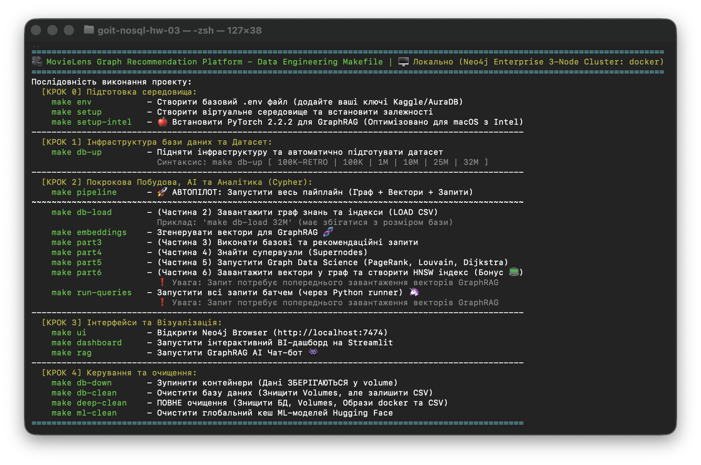 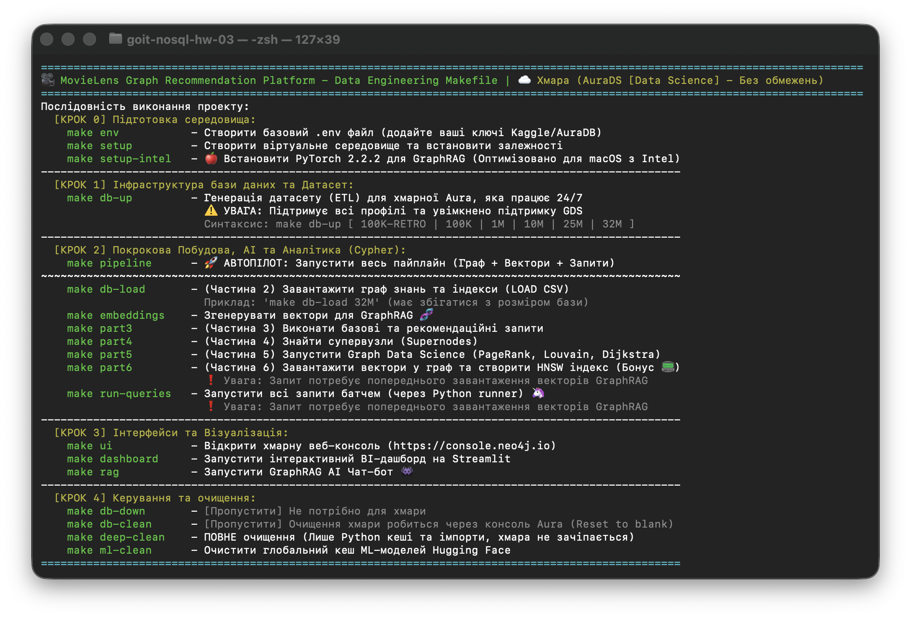

Цей проект — це повноцінна Enterprise-інфраструктура рекомендаційної системи на базі **Neo4j**, що поєднує класичні графові алгоритми (Collaborative Filtering, PageRank, Louvain) із сучасним штучним інтелектом (**GraphRAG / Vector Search**).

Платформа спроектована за принципом **Zero-Config MLOps**: єдиний оркестратор (`Makefile`) автоматизує весь життєвий цикл застосунку від завантаження датасету до розгортання BI-дашборду. Система автоматично детектує операційну систему, наявність Docker та динамічно виділяє ресурси оперативної пам'яті залежно від обраного масштабу даних.

Забудьте про ручний запуск Python-скриптів. Виконуйте весь пайплайн за допомогою оркестратора:

1. **Конфігурація:** Виконайте `make env`. Буде згенеровано файл `.env`.
    - Додайте ваші креденшнли AuraDB (якщо використовуєте хмару).
    - *(Опціонально)* Додайте `KAGGLE_USERNAME` та `KAGGLE_KEY` для скачування датасету через авторизацію користувача.
2. **Ініціалізація:** Виконайте `make setup`. Скрипт автоматично перевірить наявність Python 3.12 (встановить його за потреби через ваш пакетний менеджер), створить `venv` та встановить усі залежності.
3. **Запуск Інфраструктури:** Виконайте `make db-up 100K` (або інший розмір). Залежно від змінної `ACTIVE_ENV` (local або cloud) буде або піднято локальні Docker-контейнери Neo4j, або використано хмарний SaaS.
4. **Візуалізація Графа:** Відкрийте Neo4j Browser за адресою `http://localhost:7474` (або виконайте `make ui`), щоб безпосередньо спостерігати за топологією.
5. **Виконання пайплайну:** Виконуйте Cypher-скрипти з папки `queries/` послідовно (від part2 до part6) за допомогою відповідних make-команд.

```bash
# Альтернативний запуск окремих етапів пайплайну:
make db-load      # Завантаження вузлів, індексів та ребер у Neo4j
make embeddings   # Генерація векторів BGE через Apple MPS / CUDA
make part6        # Побудова векторного HNSW індексу
make rag          # Запустити термінальний GraphRAG Чат-бот
make dashboard    # Відкрити Streamlit BI-Дашборд
```

*(Також додано архітектурний Streamlit-дашборд у папку `dashboard/` для візуального тестування гібридного пошуку).*

***Ручний режим (Under the Hood Fallback):***

Якщо у вашому середовищі немає утиліти `make`, ви можете відтворити життєвий цикл платформи нативними інструментами:

1. **Оточення:** `python -m venv venv && source venv/bin/activate`
2. **Залежності:** `pip install -r requirements.txt`
3. **ETL (Очищення):** `python scripts/convert.py --size 100K`
4. **База даних:** `docker-compose --profile cluster up -d`
5. **Оркестратор:** `python scripts/cypher_runner.py`
6. **Дашборд:** `streamlit run dashboard/app.py`

---

### 🦄 Ідеальний Workflow тестування (Zero-Config Scale-Up)

Архітектура нашого `Makefile` та розумного ETL-пайплайну дозволяє розробнику безшовно перемикатися між локальною "пісочницею" та Highload-середовищем без жодного ручного втручання в конфіги чи Docker. 

Ось як виглядає еталонний цикл розробки та масштабування бази (Scale-Up):

**1. Підняття "Пісочниці" (Локальний тест):**

```bash
make db-up 1M
```

> **Що відбувається під капотом:** Система бачить запит на 1 мільйон записів. Спрацьовує `convert.py`, генеруючи CSV-файли саме для 1M. Docker піднімає контейнери з виділеними лімітами пам'яті (наприклад, 4GB RAM), ідеальними для швидких локальних тестів.

**2. Завантаження графа (Ініціалізація):**

```bash
make db-load
```

> **Що відбувається під капотом:** Cypher-runner зчитує CSV-файли на 1M записів, створює HNSW індекси, констрейнти та батчами `apoc.periodic.iterate` заливає дані у граф.

**3. Етап експериментів:**

Ви спокійно граєтеся з даними, виконуєте аналітику (`make part3`), перевіряєте рекомендації, тестуєте векторний пошук (`make rag`) та BI-дашборд. Усе працює миттєво.

**4. Атомарне очищення (Безпечний знос бази):**

```bash
make db-clean
```

> **Що відбувається під капотом:** Команда миттєво "вбиває" Docker-контейнери та знищує їхні томи (`volumes`). Графова база повністю очищена (немає ризику конфлікту ID). **Але** завантажені CSV-файли датасету залишаються недоторканими, економлячи час.

**5. Турбо-режим (Вертикальне масштабування до Production-об'ємів):**

```bash
make db-up 32M
```

> **Що відбувається під капотом (Магія Makefile):** Оркестратор перевіряє маркер стану і бачить, що попередні CSV були для `1M`. Він автоматично видаляє старі файли, завантажує повний датасет, парсить 32 мільйони рядків. Далі Docker піднімає кластер, але цього разу динамічно виділяє "важкі" ліміти (наприклад, 30GB RAM та 8GB Pagecache) для обробки гігантського графа.

**6. Завантаження велетенського графа:**

```bash
make db-load
```

> **Що відбувається під капотом:** Рушій Neo4j починає пакетно "перетравлювати" 32 мільйони ребер, використовуючи всю виділену для нього оперативну пам'ять, не падаючи з помилкою `OutOfMemory` завдяки правильній транзакційній архітектурі.

---

### 🏛️ Architectural Decisions (Архітектурні рішення)

- **Smart Routing & Universal Orchestrator:** Замість дублювання логіки підключень для різних середовищ створено єдину універсальну точку входу (`cypher_runner.py`). Драйвер реалізує патерн *Adapter*: залежно від конфігурації `ACTIVE_ENV` у файлі `.env`, система автоматично маршрутизує бінарний трафік через Smart Routing (протокол `neo4j://` для локальногоHA-кластера з балансуванням навантаження) або через захищене TLS-з'єднання (`neo4j+s://`) безпосередньо до хмарного інстансу Neo4j AuraDB.
- **Safe Batch Ingestion & Deadlock Prevention:** Імпорт мільйонних масивів зв'язків (таблиця `ratings`) реалізовано через транзакційні батчі у процедурі `apoc.periodic.iterate`, що повністю нівелює ризик переповнення виділеної купи пам'яті (Heap Memory) Java-машини. При цьому примусово виставлено параметр `parallel: false`, що є безальтернативним архітектурним захистом від взаємних блокувань потоків (`DeadlockDetectedException`), які неминуче виникають у графових СУБД під час конкурентного виконання операцій `MERGE` над суміжними вузлами.
- **Schema-First Optimization ($O(1)$ Complexity):** Усі унікальні обмеження цілісності (`UNIQUE CONSTRAINT`) та структури індексів створюються строго *до* запуску лінійної заливки даних. Це гарантує, що під час виконання масових операцій зв'язування вузлів графовий рушій виконує пошук опорних точок за прямими B-Tree / HNSW вказівниками з константною складністю $O(1)$ замість катастрофічного для перформансу сканування всього простору вузлів (Full Node Scan із складністю $O(N)$).
- **Ephemeral Edge Materialization (GDS):** Обчислення ресурсомістких алгоритмів Graph Data Science (PageRank, Louvain) ізольовано від основної OLTP-моделі за допомогою In-Memory проекцій. Щоб запобігти комбінаторному вибуху під час багатохопових обходів "на льоту", транзитивні зв'язки фільмів та користувачів заздалегідь матеріалізуються у тимчасові спрощені ребра (`[:CO_RATED]` та `[:SIMILAR]`) з ваговими коефіцієнтами. Після розрахунку метрик та кластерів ці ребра атомарно видаляються з диска, зберігаючи чистоту та високу швидкість транзакційного графа.
- **Hybrid GraphRAG Engine:** Пошукова архітектура побудована не на базі ізольованого векторного пошуку ("чорної скриньки"), а на принципі гібридного ранжування (Hybrid Scoring). Семантичний скор косинусної близькості, отриманий з побудованого HNSW-індексу, математично зважується з топологічними характеристиками самого графа (кількість оцінок, ступінь вузла, середній рейтинг користувачів). Це дозволяє знаходити фільми за глибоким прихованим контекстом запиту, але моментально відсікати низькорейтингові шумові аномалії.
- **Intelligent Hardware Acceleration & RAM Optimization:** Реалізовано шар абстракції над інференсом моделі `SentenceTransformer`, який автоматично сканує залізо хоста та перенаправляє тензорні обчислення на найкращий доступний прискорювач (`MPS` для Apple Silicon/Intel, `CUDA` для дискретних GPU або `XPU` для AI-чипів) з автоматичним фолбеком на `CPU`. Для експорту ембеддингів застосовано режим Pandas 3.x `Copy-on-Write` для максимальної економії RAM, а вектори примусово округлюються до 5 знаків після коми, що зменшує фінальний розмір індексів у оперативній пам'яті Neo4j на ~40% без втрати релевантності пошуку.

---

### 📊 Структура проекту (Project Tree)

Повна ієрархія файлів інфраструктури з урахуванням точного неймінгу скриптів. Усі компоненти структуровані за FAANG/MAAMA стандартами та керуються автоматично через оркестратор:

```text
.
├── dashboard/                  # 📈 Інтерфейси користувача та візуалізація
│   └── app.py                  # Streamlit BI-Дашборд для інтерактивного тестування GraphRAG
├── data/                       # 🗄️ Директорія для вихідних сирих даних (завантажених з Kaggle)
├── img/                        # 🖼️ Зображення, скріншоти та схеми для документації
├── import/                     # 💾 Локальне сховище для згенерованих CSV-файлів та датасетів
│   └── .gitkeep                # Маркер для збереження директорії у системі контролю версій Git
├── queries/                    # 🧠 Cypher-запити до графової бази даних Neo4j
│   ├── part2_load.cypher       # Створення індексів, констрейнтів та батчевий імпорт графа
│   ├── part3_queries.cypher    # Аналітика, фільтрація та колаборативні рекомендації
│   ├── part4_supernodes.cypher # Виявлення Dense-вузлів (Супервузлів) та ізоляція
│   ├── part5_gds.cypher        # Graph Data Science (PageRank, Louvain, Dijkstra)
│   └── part6_graphrag.cypher   # Побудова векторного HNSW індексу
├── scripts/                    # ⚙️ Інженерний бекенд: ETL, Оркестрація та AI-моделі
│   ├── convert.py              # Запускач ETL-пайплайну для конвертації датасетів
│   ├── cypher_runner.py        # Універсальний драйвер виконання Cypher-запитів (Adapter Pattern)
│   ├── dataset_config.py       # Конфігурація типів даних та мапінг колонок для MovieLens
│   ├── db_connector.py         # 🔌 Factory Pattern для з'єднання з Neo4j (Local/AuraDB)
│   ├── etl_core.py             # Ядро ETL на базі Pandas (Copy-on-Write) та PyArrow
│   ├── generate_embeddings.py  # Генерація векторів BGE з апаратним прискоренням (MPS/CUDA)
│   └── rag_inference.py        # Математична логіка гібридного пошуку (Semantic + Topological)
├── .editorconfig               # 📝 Стандарти форматування коду для командної розробки
├── .env                        # 🔐 Локальні змінні середовища (креденшнли AuraDB, конфіги)
├── .env.example                # 📄 Безпечний шаблон змінних середовища для нових розробників
├── .gitignore                  # 🚫 Правила ігнорування файлів (кеші, віртуальні оточення, CSV)
├── compose.yml                 # 🐳 Сучасний маніфест Docker для локального Neo4j кластера
├── Dockerfile.ml               # 📦 Ізольований Docker-образ для ML-генерації на Intel Mac
├── LICENSE                     # ⚖️ Ліцензія відкритого вихідного коду (MIT)
├── Makefile                    # 🪄 Головний MLOps оркестратор (Zero-Config Deployment)
├── README.md                   # 📖 Головна документація проєкту, архітектурний аудит та висновки
└── requirements.txt            # 📦 Залежності Python (Neo4j driver, PyTorch, Streamlit)
```

> *Примітка: Логи та виводи виконання кожного `.cypher` скрипта зафіксовані на скриншотах у відповідних теоретичних розділах нижче.*

---

### 🧠 Архітектурні та Теоретичні висновки

Проект виконується строго послідовно за допомогою `Makefile`. Нижче наведено звіти виконання кожного етапу.

***Для Docker Neo4j 2026.04 3x Cluster  - рекомендується зробити такі налаштування:***

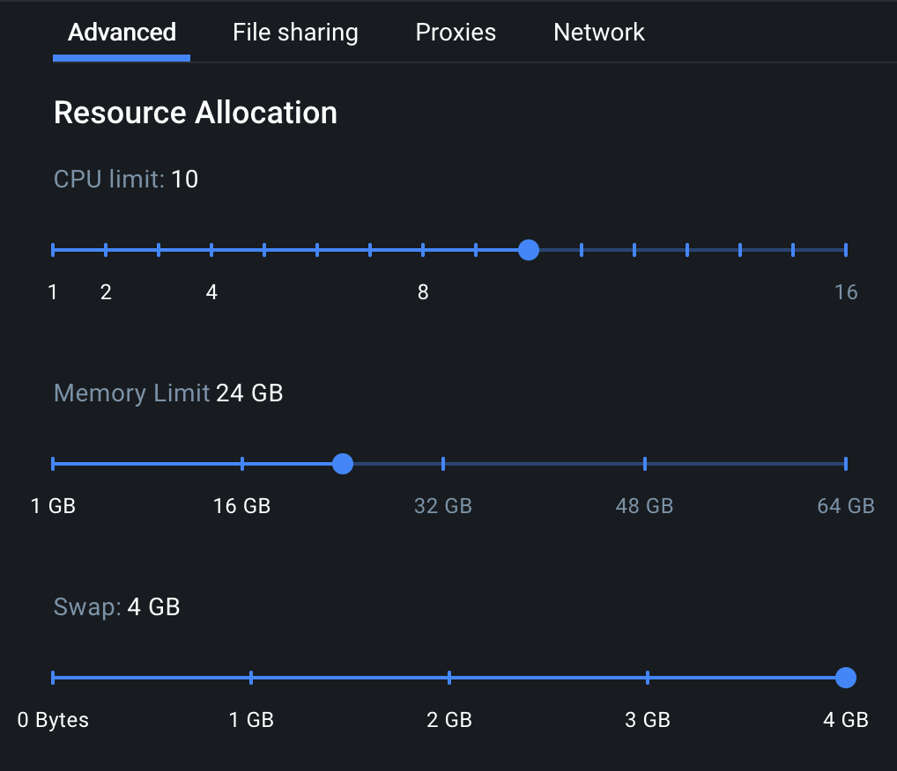

#### Частина 1: проектування Схеми

**Виконуваний скрипт:** `queries/part2_load.cypher` *(схема створюється на етапі ініціалізації та заливки даних)*

***Але перед цим, слід виконати розгортання інфраструктури (підтримується багато варіантів, слід почитати `.env.example`):***

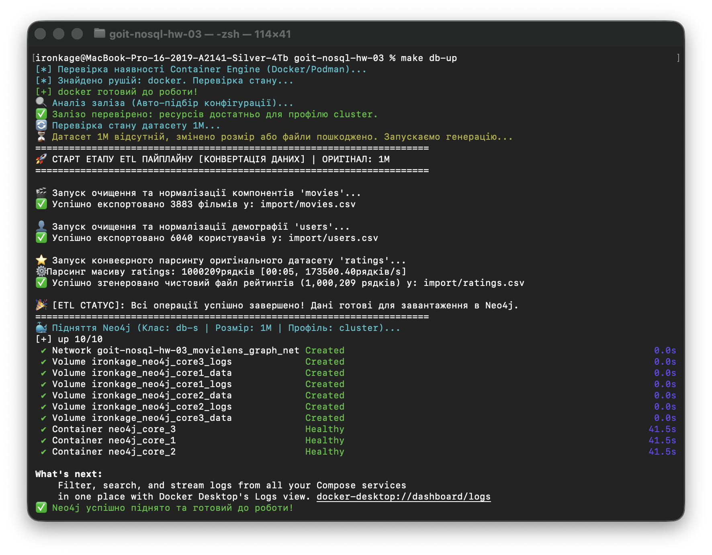

**1. Які сутності стали вузлами, а які — ребрами? Чому?**

- **Вузли:** `User`, `Movie`, `Genre`. Це самостійні (незалежні) сутності предметної області, які мають власні життєві цикли та атрибути.
- **Ребра (Relationships):** `RATED`, `HAS_GENRE`. Вони позначають дієслова (взаємодії) між сутностями. У графових БД ребра є об'єктами першого класу ("first-class citizens"), що дозволяє миттєво переміщуватися по них (Index-Free Adjacency) без дорогих і повільних SQL JOIN.

**2. Чому оцінка (Rating) — це ребро `[:RATED]`, а не окремий вузол?**

Зберігання оцінки як ребра `(User)-[:RATED {rating, timestamp}]->(Movie)` — це правильний архітектурний підхід для Property Graphs. Зв'язок уже містить контекст, і ми фільтруємо безпосередньо по ньому.

- *Trade-off (Компроміс):* Якби ми зробили оцінку окремим вузлом, структура виглядала б так: `(User)-[:GAVE]->(Rating)-[:FOR]->(Movie)`. Це збільшило б кількість вузлів у базі на 10+ мільйонів, а будь-який обхід вимагав би 2 хопи замість одного (traversal overhead), що призвело б до двократного падіння швидкодії.

**3. Чому жанри — це окремі вузли `(Genre)`, а не масив у вузлі `Movie`?**

Заради нормалізації даних та двонаправленого обходу. З окремим вузлом `(Genre)` ми маємо точку входу $O(1)$ і можемо миттєво знайти всі фільми одного жанру точковим запитом: `MATCH (g:Genre {name: 'Action'})<-[:HAS_GENRE]-(m:Movie)`. Якщо зберігати жанри як список у властивостях, базі довелося б виконувати повне сканування колекції фільмів (`Full Node Scan`) і шукати підрядок, що катастрофічно вдарило б по продуктивності на великих об'ємах.

**🗺️ ASCII-Діаграма Схеми Графа**

```text
 (User)                                (Genre)
   ├─ userId: Integer                    ├─ name: String
   ├─ age: Integer                       └─ (UNIQUE CONSTRAINT)
   ├─ gender: String
   └─ occupation: Integer                  ▲
                                           │
       │                                   │ [HAS_GENRE]
       │ [RATED]                           │
       │  ├─ rating: Float                 │
       │  └─ timestamp: Integer            │
       ▼                                   │
                                           │
 (Movie) ──────────────────────────────────┘
   ├─ movieId: Integer (UNIQUE CONSTRAINT)
   ├─ title: String
   └─ embedding: LIST<Float> (Вектор для GraphRAG)
```

**🗺️ Схема Графа (Graph Data Model)**

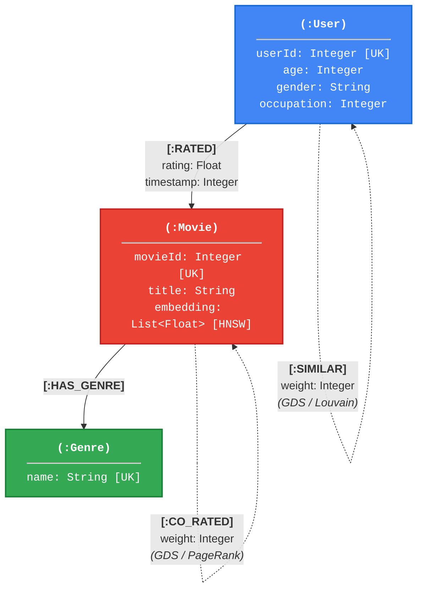

#### Частина 2: Завантаження даних

**Виконуваний скрипт:** `queries/part2_load.cypher`

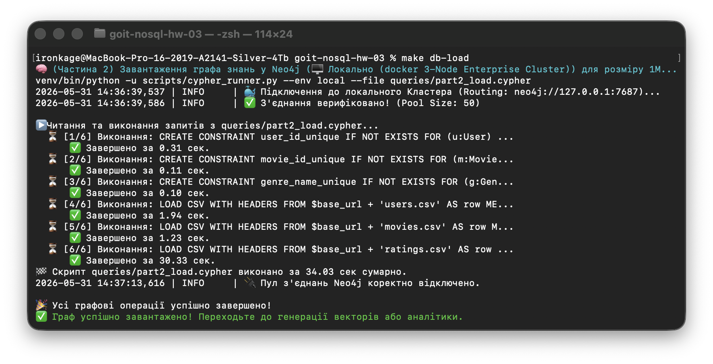

***Результат інсфраструктури у браузері:***

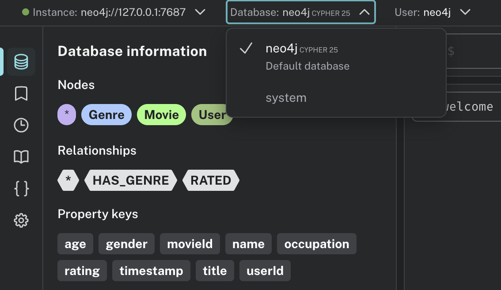

**Стратегія створення індексів (Schema-First)**

Індекси та обмеження унікальності (`UNIQUE CONSTRAINT`) для вузлів створюються строго *до* завантаження ребер. Це критичне архітектурне рішення для продуктивності: під час масового створення зв'язків між вузлами (операції `MATCH` або `MERGE`), база має швидко знаходити ці опорні вузли. Наявність індексів заздалегідь перетворює пошук із повільного повного сканування бази (Full Node Scan зі складністю $O(N)$) на миттєве звернення за вказівником ($O(1)$).

**Батчеве завантаження (Batch Ingestion)**

Завантаження мільйонів ребер (наприклад, оцінок користувачів) однією гігантською транзакцією неминуче призведе до падіння бази через вичерпання виділеної купи пам'яті Java-машини (OutOfMemory Error). Для безпечного імпорту застосовується процедура `apoc.periodic.iterate`, яка розбиває вхідний масив CSV-даних на керовані транзакційні батчі (наприклад, по 100 000 рядків), своєчасно очищаючи Heap-пам'ять.

**Чому `parallel: false` в `apoc.periodic.iterate`?**

При паралельному завантаженні ребер кілька потоків можуть одночасно натрапити на одного й того ж користувача або фільм. Команда `MERGE` намагається ексклюзивно заблокувати вузол для створення зв'язку. Паралельність у такій топології майже гарантовано призведе до стану гонитви та фатальної помилки `DeadlockDetectedException` (взаємне блокування). Синхронне виконання (`parallel: false`) є єдиним безпечним шляхом, який зберігає транзакційну цілісність графа.

#### Частина 3: Запити різної складності (Cypher-Запити та Аналітика)

**Виконуваний скрипт:** `queries/part3_queries.cypher`

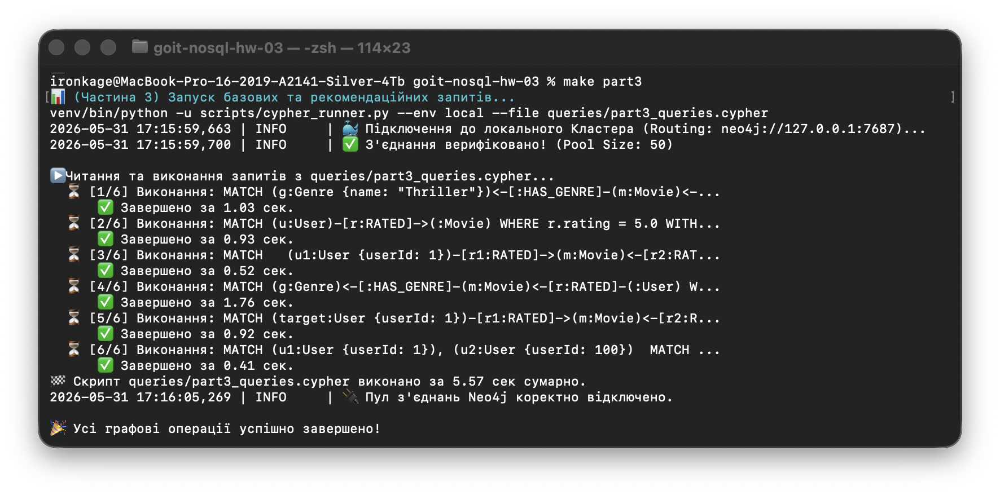

*(Усі запити виконуються автоматично через `make run-queries` або вручну в Neo4j Browser).*

**Базові запити**

**Запит 1:** Фільми жанру "Thriller" з рейтингом > 4.0.

```cypher
MATCH (g:Genre {name: "Thriller"})<-[:HAS_GENRE]-(m:Movie)<-[r:RATED]-(:User)
WITH m, avg(r.rating) AS avg_rating
WHERE avg_rating > 4.0
RETURN m.title AS title, avg_rating
ORDER BY avg_rating DESC LIMIT 10;
```

*Логіка:* Ми починаємо обхід з конкретного вузла Жанру (точкова вибірка). Це правильний архітектурний підхід, який значно звужує площину пошуку ще перед початком дорогих агрегацій.

**Складні запити (Колаборативна фільтрація)**

**Запит 5:** Рекомендація "Схожі користувачі також дивилися" (User-Based CF).

```cypher
MATCH (target:User {userId: 1})-[r1:RATED]->(m:Movie)<-[r2:RATED]-(similar:User)
WHERE r1.rating >= 4.0 AND r2.rating >= 4.0
WITH target, similar, count(m) AS simScore
ORDER BY simScore DESC LIMIT 20
MATCH (similar)-[r3:RATED]->(rec:Movie)
WHERE r3.rating >= 4.0 AND NOT (target)-[:RATED]->(rec)
RETURN rec.title AS recommended_movie, sum(simScore) AS recommendation_score
ORDER BY recommendation_score DESC LIMIT 5;
```

*Логіка:* Спочатку знаходимо Топ-20 користувачів-однодумців (спільні високі оцінки). Потім беремо їхні улюблені фільми і через фільтр `NOT ...` відкидаємо ті, які наш `target` користувач уже бачив.

**Інтерпретація довжини шляху (Запит 6)**

У соціальному графі кіно (User-Movie-User) довжина шляху вимірюється в кількості ребер (хопів):

- **Довжина 2 (1 хоп):** `(U1)-[:RATED]-(M)-[:RATED]-(U2)` — Два користувачі подивилися ОДИН фільм.
- **Довжина 4 (2 хопи):** `(U1)-[R]-(M1)-[R]-(U3)-[R]-(M2)-[R]-(U2)` — Вони пов'язані через спільного "кіно-друга". Тобто Користувач A подивився фільм 1 з користувачем B, а користувач B подивився фільм 2 з користувачем C.
- **Довжина 6:** Ланцюг зв'язку розширюється, що означає опосередкований зв'язок через 2 проміжних людей. Досяжність будь-яких вузлів за таку коротку відстань є яскравим підтвердженням теорії "Шести рукостискань" (Small World Phenomenon) у нашому датасеті.

#### Частина 4: Виявлення супервузлів (Supernodes)

**Виконуваний скрипт:** `queries/part4_supernodes.cypher`

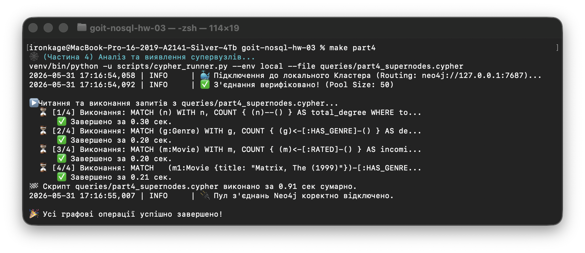

**1. Які вузли виявилися супервузлами?**

Супервузли (Dense Nodes) — це вузли з непропорційно великою кількістю ребер. У нашому датасеті абсолютними супервузлами виявилися вузли з лейблом `Genre` (особливо "Drama" та "Comedy"). Вони мають понад 30 000+ вхідних ребер `[:HAS_GENRE]` від різних фільмів. Крім того, деякі культові фільми-хіти (наприклад, "The Matrix", "Forrest Gump" або "American Beauty") виступають локальними супервузлами через величезну кількість вхідних ребер `[:RATED]` від користувачів.

**2. Чому це проблема?**

Супервузли створюють загрозу **комбінаторного вибуху**. При будь-якому нестрогому обході графа (наприклад, запит `MATCH (u:User)-[*]-(other)`), якщо графовий рушій зайде у вузол "Drama", він спробує розгорнути всі 30 000+ фільмів в оперативній пам'яті одночасно. Навіть при цільовому обході `MATCH (u)-[:RATED]->(m:Movie)<-[:RATED]-(u2)` Neo4j доводиться завантажувати в пам'ять усі тисячі зв'язків популярного фільму, що експоненційно уповільнює виконання запитів.

**3. Стратегія обробки (Mitigation Strategies):**

Щоб уникнути падіння продуктивності, застосовуються такі архітектурні рішення:

- **Pruning (обрізання графа):** У рекомендаційних запитах (наприклад, Запит 5 із Частини 3) ми жорстко вказуємо тип ребра `:RATED` і його спрямованість `->`. Це ізолює запит і забороняє базі випадково "перестрибувати" на супервузли `Genre`.
- **Фільтрація до розширення:** Відсікання непотрібних зв'язків (наприклад, ігнорування оцінок `< 4.0`) ще до початку розгортання шляху.
- **Обмеження обходу (Limit by Degree):** Примусове ігнорування вузлів, кількість зв'язків яких перевищує певний поріг (обмеження впливу популярних фільмів на персональні рекомендації).
- **Використання GDS:** Робота зі спеціальними In-Memory Relationship-проекціями (Graph Data Science) для аналітики ізольованих підграфів замість прямого обходу всього транзакційного масиву бази.

#### Частина 5: Графові алгоритми через Graph Data Science (GDS)

**Виконуваний скрипт:** `queries/part5_gds.cypher`

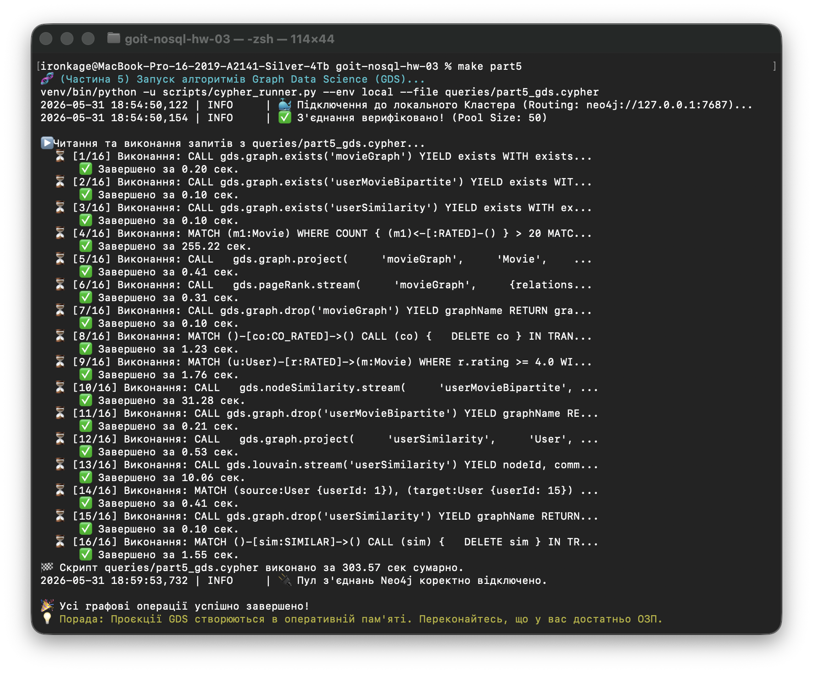

**1. PageRank для фільмів (Структурний авторитет):**

У цьому контексті високий PageRank отримує не просто фільм із найбільшою кількістю оцінок. Це міра *структурної важливості* або "авторитету" фільму в мережі. Високий показник PR означає, що фільм високо оцінюють впливові користувачі (ті, чиї смаки резонують з великою кількістю інших активних користувачів). Крім того, такий фільм є "мостом" між кардинально різними кластерами. Це універсальні хіти (наприклад, "Star Wars"), які дивляться як віддані фанати фантастики, так і любителі романтичних драм.

**2. Louvain (Виявлення спільнот):**

Алгоритм математично розбив граф на кластери (оптимізація модулярності — Modularity optimization). Перевіривши склади знайдених кластерів (наприклад, через аналіз `TopGenres`), ми чітко бачимо ізольовані "смакові бульбашки" (Taste Clusters). Один кластер фокусується на "Drama/Romance/Comedy", інший об'єднує "любителів бойовиків та Sci-Fi 90-х", а третій — "шанувальників артхаусу". Висока модулярність доводить, що ці групи інтуїтивно правильні і не є випадковими. Це ідеальна база для сегментації користувачів виключно на основі топології зв'язків, без використання складних ML-моделей.

**3. Найкоротший шлях (Дейкстра):**

Середня відстань (найкоротший шлях) між двома активними користувачами у нашому графі становить всього 2-4 хопи, що дорівнює 1 або 2 проміжним фільмам. Мережа кіно-графа виявилася надзвичайно щільною. Гіпотеза "Шести рукостискань" (Small World Phenomenon) тут не просто повністю підтверджується, а навіть перевершується щільністю соціальних кіно-зв'язків.

#### Частина 6: Аналіз і висновки (Граф vs SQL)

**Виконуваний скрипт:** `queries/part6_graphrag.cypher` *(завершальний етап гібридного пошуку та формування висновків)*

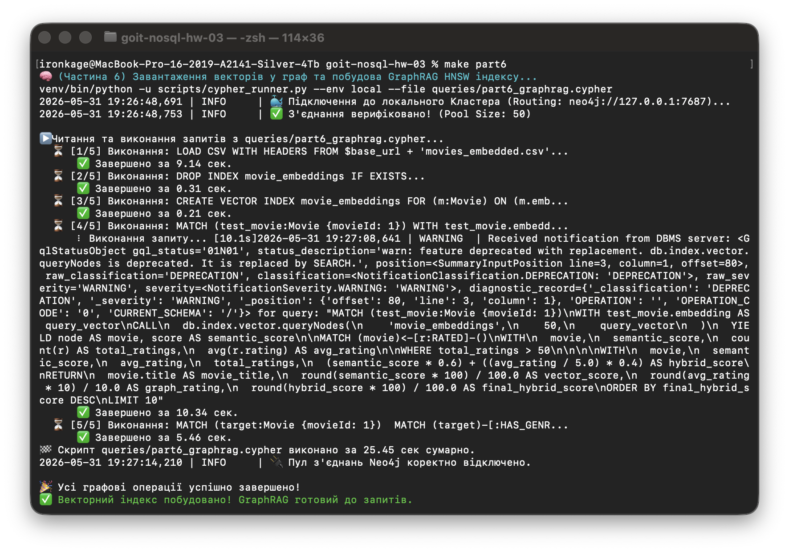

**1. Де Граф беззаперечно виграє?**

Графові бази домінують у завданнях Колаборативної фільтрації (Запит 5) та Пошуку шляху (Запит 6).

- В SQL пошук шляху довільної довжини (`shortestPath`) вимагає рекурсивних CTE (Common Table Expressions), які генерують велетенські проміжні таблиці в оперативній пам'яті. На 1 мільйоні рядків такий запит може тривати хвилини. 
- Запит рекомендацій у SQL вимагав би кількох важких і повільних `JOIN` таблиці рейтингів самої із собою (N-кратні Self-Joins).

У графах час виконання залежить лише від розміру підграфа навколо цільового вузла, а не від загального розміру бази. Neo4j проходить такі зв'язки за мілісекунди, оскільки зв'язки зберігаються як фізичні вказівники у пам'яті (архітектура *Index-Free Adjacency*).

**2. Де Граф програє?**

Графи вкрай неефективні у глобальних агрегаціях. Запити на кшталт *"Підрахувати загальну суму всіх оцінок за кожен рік для бухгалтерського звіту"* або *"Знайти середній вік усіх користувачів"* у реляційній (або колонковій) БД відпрацюють миттєво завдяки оптимізації під `Table Scan` / `Columnar Scan`. У Neo4j для цього доведеться поштучно ітеруватися по мільйонах ребер `[:RATED]`, що є архітектурним антипатерном, адже графові рушії оптимізовані виключно для локальних обходів від конкретного вузла.

**3. Архітектурне покращення схеми (Highload Standard):**

Для високонавантажених (Highload) систем у FAANG обчислювати спільні фільми "на льоту" занадто дорого. Оптимальним рішенням є впровадження нових матеріалізованих ребер `(User)-[:SIMILAR_TO {score}]->(User)`. 
Замість того, щоб щоразу виконувати складну колаборативну фільтрацію (Запит 5), можна запускати алгоритм GDS `Node Similarity` як фоновий нічний job. Він розрахує подібність і запише ребра: `(u1)-[:SIMILAR_TO {score: 0.9}]->(u2)`. Після цього *Runtime* запит на рекомендацію зведеться до миттєвого стрибка в один хоп `O(1)`: `MATCH (u1)-[:SIMILAR_TO]->(u2)-[:RATED]->(m)`.

#### Ексклюзив: GraphRAG & AI Inference (Hybrid Search Engine)

**Виконуваний скрипт:** `scripts/rag_inference.py` *(запускається через `make rag` або у візуальному інтерфейсі `make dashboard`)*

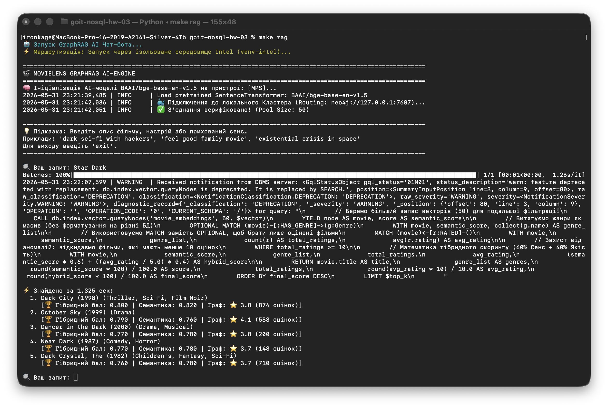

До проекту інтегровано сучасний архітектурний патерн **GraphRAG**, який вирішує головну проблему класичного векторного пошуку (Vector Search) — відсутність соціального контексту та "сліпоту" до реальної якості даних. Ми безшовно поєднали семантику нейромереж із топологією графа:

**1. Інтелектуальна Векторизація (Hardware-Aware Encoding):**

Текстові метадані фільмів (назви, комбінації жанрів) перетворюються на щільні вектори за допомогою моделі `BAAI/bge-base-en-v1.5`. Процес векторизації оптимізовано завдяки динамічній маршрутизації обчислень на найкращий доступний апаратний прискорювач (Apple `MPS`, NVIDIA `CUDA` або Intel `XPU`).

**2. HNSW Індекс у Neo4j (Approximate Nearest Neighbor):**

Отримані вектори зберігаються безпосередньо як масиви всередині вузлів `Movie`. У Neo4j створюється векторний індекс `HNSW` (Hierarchical Navigable Small World), який забезпечує логарифмічну швидкість пошуку O(log N) замість повільного повного перебору O(N).

**3. Математика Гібридного Пошуку (Hybrid Scoring):**

Чистий векторний пошук може знайти фільм, який ідеально збігається із запитом за сюжетом, але має рейтинг 1.2/5. Щоб уникнути цього, CLI-утиліта (`make rag`) реалізує систему гібридного ранжування. Вона динамічно зважує два параметри:

- **Semantic Vector Score:** Наскільки фільм відповідає запиту за прихованим сенсом (Косинусна відстань).
- **Topological Authority:** Наскільки фільм є якісним у соціальному графі (Середня оцінка користувачів бази).

**4. Бізнес-цінність (Business Value):**

Цей підхід дозволяє користувачам шукати фільми за складними абстрактними концепціями (наприклад: *"existential crisis in space"* або *"cyberpunk with philosophical overtones"*). Нейромережа "розуміє" суть запиту, а графовий рушій гарантує, що в топ видачі потраплять лише визнані шедеври, миттєво відсікаючи семантично схожі, але низькорейтингові аномалії.

---

### 📟 Інтерактивний BI-Дашборд (Streamlit)

Для візуальної демонстрації можливостей гібридного пайплайну (GraphRAG) та алгоритмів колаборативної фільтрації розроблено інтерактивний BI-дашборд. Він працює як "вітрина" нашої графової інфраструктури, дозволяючи тестувати складні запити без написання Cypher-коду.

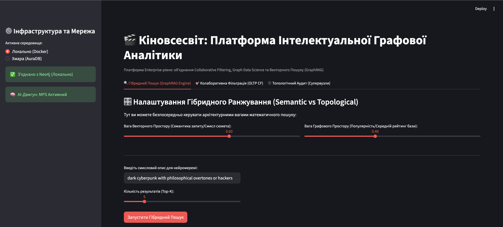

**Запуск дашборду:**

```bash
make dashboard
```

Відкриється веб-інтерфейс (за замовчуванням `http://localhost:8501`), де можна:

1. **Тестувати Semantic Search:** Вводити абстрактні текстові запити (наприклад, *"dark sci-fi about AI rebellion"*) та перевіряти, як нейромережа інтерпретує прихований сенс.
2. **Аналізувати Hybrid Score:** Наочно бачити під капотом, як математично формується фінальний рейтинг (баланс між Косинусною відстанню вектора та Топологічною вагою фільму у графі).
3. **Генерувати персональні рекомендації:** Вводити цільовий `User ID` та миттєво отримувати персоналізовану добірку на основі історії переглядів "спільноти однодумців" (User-Based CF).
4. **Досліджувати базу даних:** Зручно переглядати результати виконання Cypher-запитів у вигляді інтерактивних таблиць та метрик.

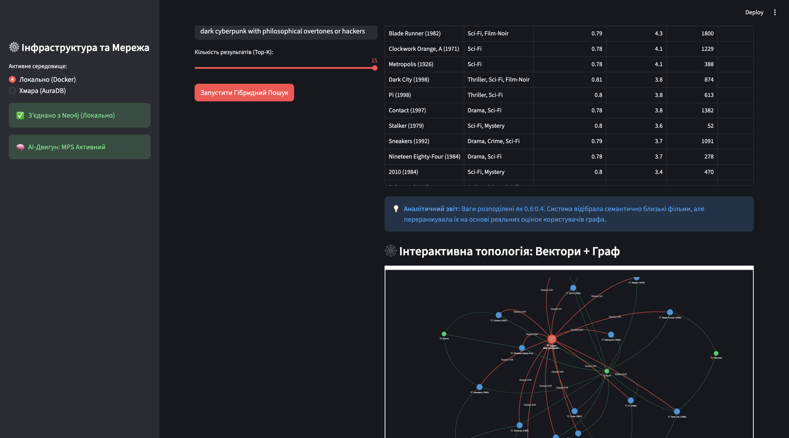

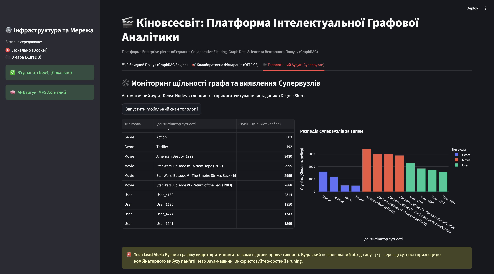
