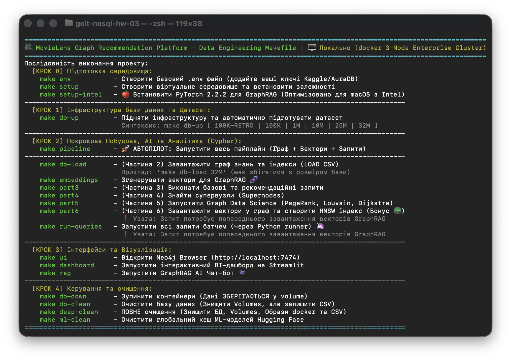
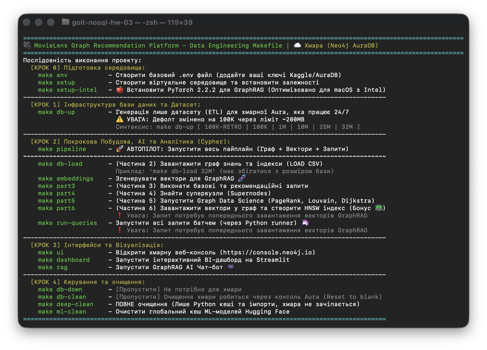

# goit-nosql-hw-03


***Технiчний опис завдань***

# **Завдання 3: Граф знань для рекомендаційної системи**

## **Цілі цього завдання:**

**Мета цього завдання:** освоїти повний цикл роботи з графовою базою даних — від проєктування схеми та завантаження реальних даних до написання складних запитів і запуску алгоритмів аналізу графів. На практиці зрозуміти, де графова модель виграє у реляційної, а де програє.

## **Опис завдання:**

Ви будуєте рекомендаційний рушій на основі графа. Дані — реальний датасет фільмів з оцінками користувачів.

**Датасет:** [MovieLens 1M](https://grouplens.org/datasets/movielens/1m) — 1 мільйон оцінок від 6 040 користувачів для 3 883 фільмів, з жанрами та демографією. Зібраний GroupLens Research широко використовується в академічних дослідженнях рекомендаційних систем.

Архів містить три файли даних і `README` з детальним описом — прочитайте його до початку роботи:

- `movies.dat` — 3 883 фільми: унікальний ID, назва з роком випуску та список жанрів через `|` (18 жанрів: від `Action` і `Comedy` до `Film-Noir` і `Children's`)
- `users.dat` — 6 040 користувачів: стать, вікова група, код професії та поштовий індекс
- `ratings.dat` — 1 000 209 оцінок за шкалою 1–5 з Unix-таймстемпом; кожен користувач оцінив не менше 20 фільмів

Усі три файли використовують роздільник `::` і кодування **Latin-1** — це важливо при завантаженні (*детальніше в частині 2*). Завантажте архів і розпакуйте його.

### Хід роботи:

1. Завантажити та розпакувати датасет MovieLens 1M, конвертувати `.dat` файли у CSV
2. Розгорнути Neo4j через Docker або зареєструватися в AuraDB
3. Спроєктувати схему графа та обґрунтувати рішення — вузли, ребра, властивості
4. Завантажити дані: створити індекси, завантажити вузли та ребра батчами
5. Написати 6 Cypher-запитів зростаючої складності — від простих фільтрацій до рекомендацій і пошуку шляхів
6. Знайти супервузли та пояснити їхній вплив на продуктивність
7. Запустити три алгоритми GDS: PageRank, Louvain і Dijkstra — та змістовно інтерпретувати результати
8. Порівняти графовий підхід з реляційним і зробити висновки

***Структура репозиторію:***

```text
.
├── docker-compose.yml          # локальний запуск Neo4j
├── convert.py                  # конвертація .dat → .csv
├── import/                     # CSV-файли для завантаження (не комітьте самі .dat)
│   ├── movies.csv
│   ├── users.csv
│   └── ratings.csv
├── queries/
│   ├── part2_load.cypher       # створення індексів і завантаження даних
│   ├── part3.cypher            # всі запити частини 3
│   ├── part4_supernodes.cypher
│   └── part5_gds.cypher
└── README.md                   # відповіді на всі питання + скриншоти
```

---

## 🔹 **Налаштування оточення**

Дозволяються два варіанти — **оберіть будь-який**.

### **Варіант A: Neo4j локально через Docker**

Збережіть файл `docker-compose.yml` у корінь проєкту:

```dockerfile
services:
neo4j:
image: neo4j:5.18-community
container_name: neo4j_movielens
ports:
-"7474:7474"
-"7687:7687"
environment:
NEO4J_AUTH: neo4j/password123
NEO4J_PLUGINS:'["apoc", "graph-data-science"]'
NEO4J_dbms_security_procedures_unrestricted:"apoc.*,gds.*"
NEO4J_dbms_security_procedures_allowlist:"apoc.*,gds.*"
NEO4J_dbms_memory_heap_initial__size:"512m"
NEO4J_dbms_memory_heap_max__size:"2G"
volumes:
- neo4j_data:/data
- neo4j_logs:/logs
- ./import:/var/lib/neo4j/import

volumes:
neo4j_data:
neo4j_logs:
```

***Запуск:***

```bash
docker-compose up -d
```

Після старту відкрийте [`http://localhost:7474`](http://localhost:7474) — Neo4j Browser.

Логін: `neo4j`, пароль: `secret12345`.

Скопіюйте файли датасету до папки `import/` у корені проєкту — звідти Neo4j зможе їх читати через `LOAD CSV`.

### **Варіант B: Neo4j AuraDB (хмара)**

1. Зареєструйтеся на [neo4j.com/product/auradb](https://neo4j.com/product/auradb) — безкоштовного рівня достатньо для завдання
2. Створіть інстанс, збережіть виданий пароль
3. APOC і GDS підключені за замовчуванням
4. Для завантаження даних використовуйте `LOAD CSV` із публічно доступним URL або завантажуйте через Neo4j Browser (кнопка «Import»)

> ❗️ **Важливо:** безкоштовний AuraDB має обмеження на розмір бази (~200 MB). Якщо упретеся в ліміт — використовуйте підмножину даних: перші 200 000 рядків з `ratings.dat`.

---

## 🔹 **Частина 1 — Проєктування схеми**

**Мета:** перш ніж писати код, продумати структуру графа. Гарна схема — половина успіху; погана схема перетворює прості запити на муку.

### Завантаження

Опишіть схему графа: вузли (з лейблами та властивостями), типи ребер (з напрямком і властивостями). Поясніть логіку своїх рішень.

***Обов’язково дайте відповіді на такі питання (письмово у файлі README):***

1. Які сутності стали вузлами, а які — **ребрами**? Чому?
2. **Оцінка користувача за фільм** — це ребро `(User)-[:RATED]->(Movie)` чи окремий вузол `(Rating)`? Аргументуйте своє рішення. Це не риторичне запитання: в обох підходів є реальні trade-off-и.
3. Чому жанри фільму вигідніше зберігати як окремі вузли `(Genre)`, а не як список у властивості вузла `Movie`?

### 💡 Підказка щодо структури

Для старту можна взяти за основу таку модель і скоригувати під свої аргументи:

```cypher
(User {userId, gender, age, occupation})
(Movie {movieId, title, year})
(Genre {name})

(User)-[:RATED {rating, timestamp}]->(Movie)
(Movie)-[:HAS_GENRE]->(Genre)
```

**Намалюйте схему — хоча б у вигляді ASCII-діаграми в README. Це обов’язкова частина відповіді.**

---

## 🔹 **Частина 2 — Завантаження даних**

**Мета:** навчитися завантажувати великі обсяги даних у Neo4j без помилок.

### Підготовка файлів

Файли MovieLens використовують роздільник `::` і кодування Latin-1. Перед завантаженням конвертуйте їх у CSV з роздільником `,` і кодуванням UTF-8:

```py
# convert.py — запустіть один раз перед завантаженням
import csv

# movies.dat: MovieID::Title::Genres
with open('movies.dat', encoding='latin-1') as f_in, \\
     open('import/movies.csv', 'w', newline='', encoding='utf-8') as f_out:
    writer = csv.writer(f_out)
    writer.writerow(['movieId', 'title', 'genres'])
    for line in f_in:
        parts = line.strip().split('::')
        writer.writerow(parts)

# ratings.dat: UserID::MovieID::Rating::Timestamp
with open('ratings.dat', encoding='latin-1') as f_in, \\
     open('import/ratings.csv', 'w', newline='', encoding='utf-8') as f_out:
    writer = csv.writer(f_out)
    writer.writerow(['userId', 'movieId', 'rating', 'timestamp'])
    for line in f_in:
        parts = line.strip().split('::')
        writer.writerow(parts)

# users.dat: UserID::Gender::Age::Occupation::Zip
with open('users.dat', encoding='latin-1') as f_in, \\
     open('import/users.csv', 'w', newline='', encoding='utf-8') as f_out:
    writer = csv.writer(f_out)
    writer.writerow(['userId', 'gender', 'age', 'occupation'])
    for line in f_in:
        parts = line.strip().split('::')
        writer.writerow(parts[:4])  # zip не потрібен
```

### Завантаження вузлів

Завантажте вузли в базу даних. Всі запити збережіть у файл `part2_load.cypher`. У README поясніть кожен запит: що він робить і чому написаний саме так.

Використовуйте `MERGE` замість `CREATE` — це захист від дублювання при повторному запуску скрипту:

```cypher
// 1. Користувачі
LOAD CSV WITH HEADERS FROM 'file:///users.csv' AS row

!!! МІСЦЕ ДЛЯ ВАШОГО КОДУ !!!
```

### Індекси

Створіть індекси **до** завантаження ребер — це прискорить пошук вузлів при створенні зв’язків:

```cypher
!!! МІСЦЕ ДЛЯ ВАШОГО КОДУ !!!
```

### Завантаження ребер (оцінок)

Завантажте ребра в базу даних. Швидше за все, ребер у вас буде досить багато, тому їх не можна завантажувати однією транзакцією — вона впаде через таймаут або пам’ять. Використовуйте `apoc.periodic.iterate`, який розбиває роботу на батчі:

```cypher
!!! МІСЦЕ ДЛЯ ВАШОГО КОДУ !!!
```

> ❗️ **Чому** `parallel: false`?
> При паралельному завантаженні кілька потоків можуть одночасно спробувати створити один і той самий вузол. Якщо ви впевнені, що вузли вже створені і використовуєте лише `MATCH` (не `MERGE`) у тілі — можна спробувати `parallel: true` для прискорення. В інших випадках краще не ризикувати.

***Перевірте результат:***

```cypher
MATCH (u:User) RETURN count(u) AS users;
MATCH (m:Movie) RETURN count(m) AS movies;
MATCH ()-[r:RATED]->() RETURN count(r) AS ratings;
```

---

## 🔹 **Частина 3 — Запити різної складності**

**Мета:** навчитися писати Cypher-запити від простих фільтрацій до багатокрокових обходів графа.

**Всі запити збережіть у файл `queries/part3.cypher`. У README поясніть кожен запит: що він робить і чому написаний саме так.**

Напишіть такі запити до бази даних.

### Базові запити

#### **Запит 1.** Знайти всі фільми жанру «Thriller» із середнім рейтингом вище 4.0:

```cypher
!!! МІСЦЕ ДЛЯ ВАШОГО КОДУ !!!
```

#### **Запит 2.** Знайти користувачів, які поставили оцінку 5 більш ніж 50 фільмам:

```cypher
!!! МІСЦЕ ДЛЯ ВАШОГО КОДУ !!!
```

### Запити середнього рівня

#### **Запит 3.** Знайти фільми, які **обидва** користувачі (наприклад, userId=1 і userId=2) оцінили високо (рейтинг ≥ 4):

```cypher
!!! МІСЦЕ ДЛЯ ВАШОГО КОДУ !!!
```

#### **Запит 4.** Знайти жанри, чиї фільми стабільно отримують високі оцінки — середній рейтинг і кількість оцінок:

```cypher
!!! МІСЦЕ ДЛЯ ВАШОГО КОДУ !!!
```

### Складні запити

#### **Запит 5.** Рекомендація «користувачі зі схожими смаками також дивилися»: для заданого користувача знайти фільми, які він ще **не** дивився, але високо оцінили користувачі з подібними смаками:

```cypher
!!! МІСЦЕ ДЛЯ ВАШОГО КОДУ !!!
```

#### **Запит 6.** Знайти найкоротший ланцюжок зв’язку між двома користувачами через спільні фільми:

```cypher
!!! МІСЦЕ ДЛЯ ВАШОГО КОДУ !!!
```

***Обов’язково дайте відповіді на такі запитання (письмово у файлі README):***

1. Що означає довжина шляху в даному контексті?
2. Один хоп — це один крок по ребру `RATED`, а значить — шлях довжини 2 означає, що два користувачі оцінили один і той самий фільм.
3. Як інтерпретувати шлях довжини 4? Довжини 6?

---

## 🔹 **Частина 4 — Виявлення супервузлів**

**Мета:** зрозуміти, що таке супервузли і чому вони — проблема для продуктивності.

**Всі запити збережіть у файл `queries/part4_supernodes.cypher`. У README поясніть кожен запит: що він робить і чому написаний саме так.**

### Завдання

#### **Крок 1.** Знайдіть вузли з аномально великою кількістю ребер:

```cypher
!!! МІСЦЕ ДЛЯ ВАШОГО КОДУ !!!
```

***Обов’язково дайте відповіді на такі питання (письмово у файлі README):***

1. Які вузли виявилися супервузлами? Скільки у них зв’язків?
2. Чому запит, що зачіпає такий вузол, працює повільніше, ніж запит по «звичайному» вузлу з тими самими індексами?
3. Яку конкретну стратегію з лекцій ви б застосували для цього датасету? (Підказка: подивіться на жанрові вузли — вони теж супервузли?) Що з ними робити?

---

## 🔹 **Частина 5 — Графові алгоритми через GDS**

**Мета:** запустити три класичні алгоритми з бібліотеки Graph Data Science та змістовно інтерпретувати результати.

> ❗️ Перед запуском алгоритмів потрібно створити **проєкцію графа** в пам’яті GDS. Це окремий крок — GDS не працює безпосередньо зі збереженим графом.

**Всі запити збережіть у файл `queries/part5_gds.cypher`. У README поясніть кожен запит: що він робить і чому написаний саме так.**

### 5.1. PageRank на графі фільмів

Побудуємо граф, де фільми пов’язані через користувачів, які оцінили обидва фільми високо. Далі запустіть алгоритм PageRank на отриманому графі, проаналізуйте результати та дайте відповіді на питання в кінці секції.

```cypher
// Крок 1: матеріалізуємо ребра фільм-фільм через спільних користувачів
MATCH (m1:Movie)<-[r1:RATED]-(u:User)-[r2:RATED]->(m2:Movie)
WHERE r1.rating >= 4 AND r2.rating >= 4 AND id(m1) < id(m2)
WITH m1, m2, count(u) AS weight
WHERE size([(m1)<-[:RATED]-() | 1]) > 20
  AND size([(m2)<-[:RATED]-() | 1]) > 20
WITH m1, m2, weight
ORDER BY weight DESC
LIMIT 50000
MERGE (m1)-[co:CO_RATED]-(m2)
SET co.weight = weight;

// Крок 2: створюємо проєкцію на основі матеріалізованих ребер
CALL gds.graph.project(
  'movieGraph',
  'Movie',
  { CO_RATED: { orientation: 'UNDIRECTED', properties: 'weight' } }
)
YIELD graphName, nodeCount, relationshipCount;

!!! МІСЦЕ ДЛЯ ВАШОГО КОДУ !!!

// Крок 4: видаляємо проєкцію та тимчасові ребра
CALL gds.graph.drop('movieGraph');
MATCH ()-[co:CO_RATED]-() DELETE co;
```

> ❗️ **Попередження:** Крок 1 може зайняти кілька хвилин на повному датасеті. Якщо виконується занадто довго, зменшіть `LIMIT 50000` до меншого значення або підвищте поріг рейтингу з `>= 4` до `= 5`.

***Обов’язково дайте відповідь на таке питання (письмово у файлі README):***

1. Що означає високий PageRank для фільму в цьому графі? Це просто “популярний фільм” чи щось інше?

### 5.2. Виявлення спільнот (Louvain)

Louvain — алгоритм виявлення спільнот у графі. Він шукає групи вузлів, які щільно пов’язані між собою і слабко — з рештою графа. У нашому випадку це кластери користувачів, які дивляться схожі фільми. Якість розбиття вимірюється метрикою **modularity** — вона показує, наскільки щільність ребер всередині спільнот перевищує ту, що очікувалася б у випадковому графі з тим самим ступенем вузлів. Чим вища modularity, тим чистіші отрималися кластери.

Знайдемо кластери користувачів зі схожими смаками. Для цього побудуємо граф, у якому користувачі пов’язані між собою через фільми, яким обидва поставили високі оцінки.

Використовуючи граф схожості користувачів, застосуйте алгоритм Louvain для виявлення спільнот. Визначте розміри отриманих кластерів і виведіть 10 найбільших з них. Проаналізуйте розподіл користувачів за кластерами.

Для кожної знайденої спільноти визначте три найпопулярніші жанри фільмів (на основі фільмів з високими оцінками користувачів). Проаналізуйте отримані результати та зробіть висновки про відмінності у смаках між кластерами.

```cypher
// Крок 1: матеріалізуємо ребра користувач-користувач через спільні фільми
MATCH (u1:User)-[r1:RATED]->(m:Movie)<-[r2:RATED]-(u2:User)
WHERE r1.rating >= 4 AND r2.rating >= 4 AND id(u1) < id(u2)
WITH u1, u2, count(m) AS weight
WITH u1, u2, weight
ORDER BY weight DESC
LIMIT 50000
MERGE (u1)-[sim:SIMILAR]-(u2)
SET sim.weight = weight;

// Крок 2: створюємо проєкцію
CALL gds.graph.project(
  'userSimilarity',
  'User',
  { SIMILAR: { orientation: 'UNDIRECTED', properties: 'weight' } }
)
YIELD graphName, nodeCount, relationshipCount;

!!! МІСЦЕ ДЛЯ ВАШОГО КОДУ !!!

// Крок 5: видаляємо проєкцію та тимчасові ребра
CALL gds.graph.drop('userSimilarity');
MATCH ()-[sim:SIMILAR]-() DELETE sim;
```

> ❗️ **Попередження:**
> Крок 1 може зайняти кілька хвилин. Якщо виконується занадто довго, зменшіть `LIMIT 50000` або підвищте поріг рейтингу з `>= 4` до `= 5`.

***Обов’язково дайте відповіді на такі питання (письмово у файлі README):***

1. Чи відповідають отримані кластери інтуїтивним групам (наприклад, «любителі бойовиків», «цінителі арт-хаусу»)?
2. Як ви це перевірили?

### 5.3. Найкоротший шлях між користувачами

Скористайтеся графом з попереднього пункту. Для обраної вами пари користувачів запустіть алгоритм Дейкстри для пошуку найкоротшого шляху. Проаналізуйте кількість проміжних вузлів і дайте відповіді на питання в кінці секції.

```cypher
// Проєкція потрібна та сама, що і для Louvain — пересотворіть, якщо видалили
MATCH (u1:User)-[r1:RATED]->(m:Movie)<-[r2:RATED]-(u2:User)
WHERE r1.rating >= 4 AND r2.rating >= 4 AND id(u1) < id(u2)
WITH u1, u2, count(m) AS weight
WITH u1, u2, weight
ORDER BY weight DESC
LIMIT 50000
MERGE (u1)-[sim:SIMILAR]-(u2)
SET sim.weight = weight;

CALL gds.graph.project(
  'userGraph',
  'User',
  { SIMILAR: { orientation: 'UNDIRECTED', properties: 'weight' } }
)
YIELD graphName, nodeCount, relationshipCount;

!!! МІСЦЕ ДЛЯ ВАШОГО КОДУ !!!

CALL gds.graph.drop('userGraph');
```

***Обов’язково дайте відповіді на такі питання (письмово у файлі README):***

1. Наскільки «тісний світ» у цьому датасеті? Спробуйте кілька пар користувачів.
2. Яка середня довжина шляху? Чи підтверджується гіпотеза «шести рукостискань»?

---

## 🔹 **Частина 6 — Аналіз і висновки**

**Мета:** осмислити те, що ви побудували, і порівняти граф з реляційною моделлю.

***Напишіть у README розгорнуті відповіді (не менше абзацу на кожен пункт):***

1. **Граф vs SQL.** Які із запитів частини 3 було б складно або неможливо написати в SQL? Чому? Наведіть конкретний приклад — покажіть, як виглядав би еквівалентний SQL-запит (або поясніть, чому його не існує).
2. **Де граф програє?** Для яких задач із цим датасетом реляційна модель підійшла б краще? Наприклад: агрегація по всіх користувачах, звіти, експорт даних.
3. **Покращення схеми.** Які зміни в схемі прискорили б конкретні запити з частини 3? Розгляньте хоча б два запити.

---

## **Підготовка та завантаження домашнього завдання**

### Вимоги до README

- Схема графа (ASCII-діаграма або скриншот з Neo4j Browser → Schema)
- Відповіді на всі питання з частин 1, 3, 4, 5, 6
- Скриншоти результатів для запитів частини 3 (достатньо перших 10 рядків результату)
- Скриншоти візуалізації графа з частини 5

### Підготовка та завантаження завдання

1. Після виконання всіх етапів, скопіюйте посилання на ваш Git-репозиторій `[Ваше прізвище]_nosql_3` і прикріпіть його в LMS
2. Збережіть архів з усіма елементами вашої роботи і відповідями на питання у файлі README на свій комп’ютер. Збережений архів має також називатись `[Ваше прізвище]_nosql_3`
3. Прикріпіть його в LMS у форматі `zip`
4. Відправте завдання на перевірку

### Формат здачі

- Прикріплений архів із назвою `[Ваше прізвище]_nosql_3`
- Посилання на Git-репозиторій з кодом, всіма елементами вашої роботи і відповідями на питання (мають бути додані в `README.md`)

> ❗️ Запит, який синтаксично вірний, але повертає очевидно неправильний результат, НЕ зараховується. Працюючий запит без пояснення в README — аналогічно.

> ❗️ Від робіт очікується висвітлення вашої власної думки, інсайтів, ідей та висновків. Повністю згенеровані тексти та інші роботи за допомогою ШІ без вашого особистого внеску будуть надіслані на доопрацювання. Пам'ятайте — ШІ дозволено використовувати лише як допоміжний інструмент у процесі роботи.

---

## Граф знань для рекомендаційної системи (Neo4j)

**Студент:** Oleh Hatsenko | **Курс:** GoIT Neoversity Master of Science in AI/ML
**Архітектурний Стек:** Python 3.12, Neo4j (Local Emulator & Cloud), ..., Streamlit, GNU Make.

### 🚀 Налаштування оточення (FAANG-ready інфраструктура)

 

Цей проект спроектовано за принципом **Zero-Config**. Замість ручного запуску скриптів використовується оркестратор `Makefile`, який автоматизує весь життєвий цикл застосунку.

1. **Ініціалізація:** Виконайте `make setup`. Скрипт автоматично перевірить наявність Python 3.12 (встановить його за потреби через ваш пакетний менеджер), створить `venv` та встановить усі залежності.
2. **Конфігурація:** Виконайте `make env`. Буде згенеровано файл `.env`.
    - Додайте ваш 
    - *(Опціонально)* Додайте `KAGGLE_USERNAME` та `KAGGLE_KEY` для скачування датасету через авторизацію користувача.
3. **Запуск Інфраструктури:** Виконайте 
4. **Виконання пайплайну:** Виконуйте скрипти за допомогою відповідних make-команд.

*(Також додано архітектурний Streamlit-дашборд у папку `dashboard/` для візуального тестування гібридного пошуку).*

---

### 🏛️ Architectural Decisions (Архітектурні рішення)

- 

---

### 📊 Структура документу та Виводи скриптів

Проект виконується строго послідовно за допомогою `Makefile`. Нижче наведено звіти виконання кожного етапу.

#### Крок 1. 

---

### 🧠 Архітектурні та Теоретичні висновки

---

### 📟 DashBoard

Для демонстрації гібридного пайплайну...


**Запуск дашборду:**

```bash
make dashboard
```

Відкриється веб-інтерфейс, де можна ...
